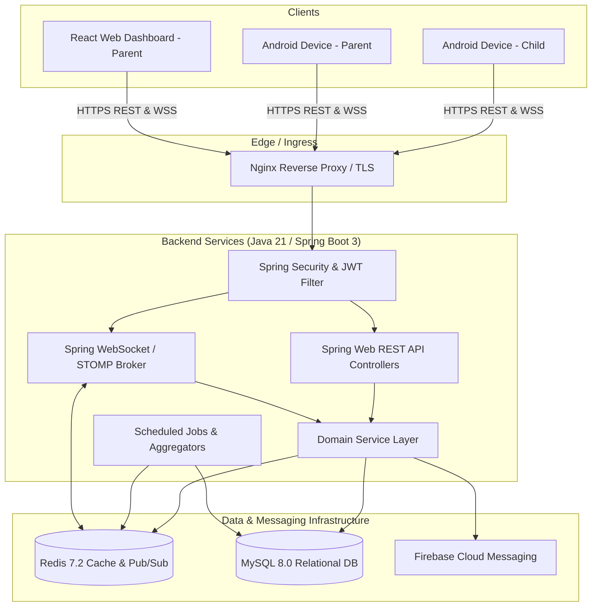
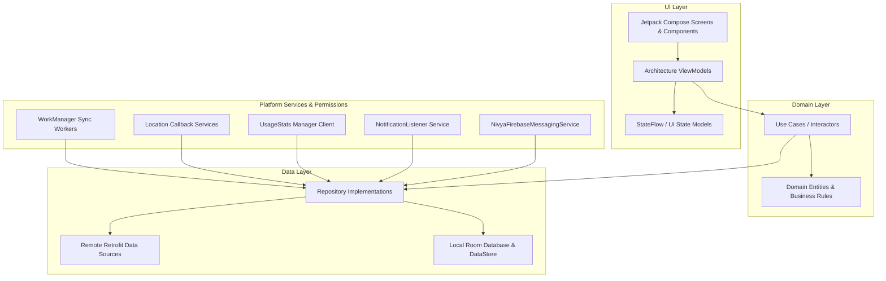
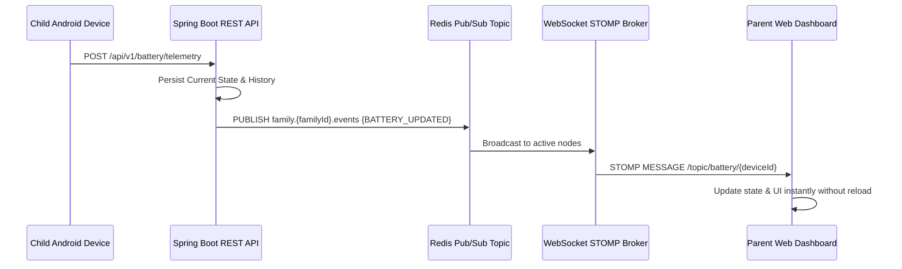

# Nivya — System Architecture Blueprint

## 1. Architectural Overview

Nivya is built on a distributed, asynchronous, role-aware client-server architecture designed for high availability, low latency, and strict boundary isolation.



---

## 2. Backend Package Architecture (`com.nivya.*`)

The backend codebase enforces modular encapsulation where each domain module owns its controllers, services, repositories, and domain models:

```
com.nivya
├── auth/           # Registration, login, token refresh, password hashing
├── user/           # User identity, profile management
├── role/           # Role definitions (ROLE_PARENT, ROLE_CHILD)
├── pairing/        # One-time connection codes, validation, persistent link
├── family/         # Family units, membership, ownership authorization
├── device/         # Device registration, sessions, heartbeats, status
├── battery/        # Battery state ingestion, historical trends
├── network/        # Network telemetry, Wi-Fi/cellular state, signal quality
├── location/       # Geolocation ingestion, reverse geocoding, paginated history
├── usage/          # Android UsageStats sync, daily/weekly aggregation
├── activity/       # Broad status-level live app activity events
├── history/        # Chronological audit timeline (Parent-only, paginated)
├── communication/  # High-level call metadata (duration, count)
├── alerts/         # Alert engine, threshold evaluation, rules
├── notification/   # FCM push notification dispatcher
├── convocation/    # Independent family messaging module
├── consent/        # User consent tracking, terms acceptance audit
├── privacy/        # Privacy settings, data sharing controls
├── audit/          # Security event auditing and compliance logs
├── safezone/       # Geofencing safe zones and entry/exit triggers
├── websocket/      # STOMP broker, session interceptors, Redis bridge
├── security/       # JWT token provider, security filters, RBAC guards
└── common/         # Global exception handlers, DTOs, AppConfig, Health
```

---

## 3. Android Architecture (Clean Architecture + Jetpack Compose)

The Android client is structured according to Google's Clean Architecture and Jetpack Compose best practices:



---

## 4. Web Dashboard Architecture (React + Vite + TypeScript)

The Parent Web Dashboard is built as a single-page application (SPA):
- **Routing**: React Router v6 with strict `ProtectedRoute` guards verifying `ROLE_PARENT`.
- **State Management**: Redux Toolkit for device telemetry, alerts, and live activity feeds.
- **Real-Time Client**: `@stomp/stompjs` with persistent WebSocket reconnection and exponential backoff.
- **UI Components**: Modular card hierarchy (`BatteryCard`, `NetworkCard`, `LocationCard`, `UsageCard`, `ActivityCard`, `AlertCard`, `DeviceCard`).

---

## 5. Real-Time Event Pipeline (WebSocket + Redis Bus)



---

## 6. Convocation Module Isolation Blueprint

Convocation operates under a zero-coupling policy:
- **No dependencies**: Never imports or calls Battery, Network, Location, or Usage services.
- **Dedicated tables**: `convocation_messages` and `convocation_views`.
- **Authoritative Server Timer**: The 2-minute visibility window is calculated on the server (`visibility_expires_at = view_started_at + 120s`).
- **1-Hour Absolute Expiration**: Server marks messages invisible to Child after 1 hour (`child_visibility_expires_at`).
- **Generic Notification**: Outgoing push to Child always has payload text: `"Check your battery status"`.
- **Child Sent Messages**: Disappear from Child view upon transmission; retained permanently in Parent history.

---

## 7. Monitoring, Remote Config & Observability

- **Remote Configuration**: Managed dynamically via `/api/v1/app/config`, controlling minimum client version enforcement, dynamic feature toggles, and sync intervals without requiring app store updates.
- **Metrics & Tracing**: Spring Boot Actuator endpoints (`/actuator/health`, `/actuator/metrics`, `/actuator/prometheus`) provide production metrics.
- **Structured Logging**: Container log driver `json-file` with size-capped log rotation (50MB / 5 files).
- **Client Monitoring**: Decoupled `AppMonitoring` interface in Android core handles non-fatal errors, diagnostic breadcrumbs, and user-role tags compatible with Crashlytics and Sentry.
