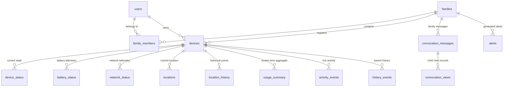

# Nivya — Database Schema & Data Retention Blueprint

## 1. Relational Database Design (MySQL 8.0)

The database schema is organized into logical domains to support high-throughput telemetry ingestion, strict multi-tenant family isolation, and independent feature boundaries.

---

## 2. Table Catalog & Schema Definitions

### 2.1 Core Identity & Family Unit
- **`users`**: Master user account records.
  - `id` (BIGINT PK, AUTO_INCREMENT)
  - `uuid` (VARCHAR(36) UNIQUE NOT NULL)
  - `name` (VARCHAR(100) NOT NULL)
  - `email` (VARCHAR(191) UNIQUE NOT NULL)
  - `phone` (VARCHAR(30))
  - `password_hash` (VARCHAR(255) NOT NULL)
  - `role` (ENUM('PARENT', 'CHILD') NOT NULL)
  - `status` (ENUM('ACTIVE', 'SUSPENDED', 'PENDING') NOT NULL DEFAULT 'ACTIVE')
  - `created_at`, `updated_at`, `last_login_at` (TIMESTAMP)

- **`roles`**: System role definition dictionary (`ROLE_PARENT`, `ROLE_CHILD`, `ROLE_ADMIN`).
- **`families`**: Family grouping entities.
  - `id` (BIGINT PK)
  - `family_code` (VARCHAR(64) UNIQUE NOT NULL)
  - `created_by` (BIGINT FK -> users.id)
  - `created_at`, `updated_at`

- **`family_members`**: Relationship bridge mapping users to families.
  - `id` (BIGINT PK)
  - `family_id` (BIGINT FK -> families.id)
  - `user_id` (BIGINT FK -> users.id)
  - `member_role` (VARCHAR(20) NOT NULL)
  - `joined_at` (TIMESTAMP)
  - UNIQUE(`family_id`, `user_id`)

- **`refresh_tokens`**: Token rotation tracking.
  - `id` (BIGINT PK), `user_id` (BIGINT FK), `token_hash` (VARCHAR(255) UNIQUE), `expires_at` (TIMESTAMP), `revoked_at` (TIMESTAMP).

---

### 2.2 Devices & Pairing Protocol
- **`devices`**: Registered physical devices.
  - `id` (BIGINT PK)
  - `device_uuid` (VARCHAR(64) UNIQUE NOT NULL)
  - `user_id` (BIGINT FK -> users.id)
  - `family_id` (BIGINT FK -> families.id)
  - `device_name` (VARCHAR(100))
  - `platform` (ENUM('ANDROID', 'WEB', 'IOS') DEFAULT 'ANDROID')
  - `os_version` (VARCHAR(50))
  - `app_version` (VARCHAR(30))
  - `push_token` (VARCHAR(512))
  - `status` (ENUM('PAIRED', 'PENDING', 'UNLINKED') DEFAULT 'PENDING')
  - `last_seen_at` (TIMESTAMP)
  - `created_at`, `updated_at`

- **`device_sessions`**: Active authentication sessions tied to hardware fingerprints.
- **`pairing_requests`**: Connection code state machine.
  - `id` (BIGINT PK)
  - `requester_user_id` (BIGINT FK)
  - `connection_code` (VARCHAR(16) NOT NULL) — *e.g., NV-4821-KP90*
  - `target_role` (ENUM('PARENT', 'CHILD') NOT NULL)
  - `status` (ENUM('PENDING', 'ACCEPTED', 'EXPIRED', 'REVOKED') DEFAULT 'PENDING')
  - `expires_at` (TIMESTAMP NOT NULL)
  - `created_at` (TIMESTAMP)
  - INDEX(`connection_code`, `status`, `expires_at`)

- **`pairing_tokens`**: Short-lived handshake tokens during initial handshake.
- **`consents`**: Cryptographically auditable record of user consent for monitoring and location.
- **`privacy_settings`**: Granular toggles per device/family member.

---

### 2.3 Real-Time Telemetry & Status (Fast-Read & Ingestion)
- **`device_status`**: Current instant state for dashboard reads.
  - `id` (BIGINT PK), `device_id` (BIGINT UNIQUE FK), `is_online` (BOOLEAN), `battery_pct` (INT), `network_type` (VARCHAR(30)), `network_quality` (VARCHAR(20)), `last_sync_at` (TIMESTAMP).
- **`battery_status`**: High-frequency battery telemetry.
  - `id` (BIGINT PK), `device_id` (BIGINT FK), `percentage` (INT), `is_charging` (BOOLEAN), `health` (VARCHAR(30)), `temperature_celsius` (FLOAT), `recorded_at` (TIMESTAMP).
- **`network_status`**: Connectivity telemetry.
  - `id` (BIGINT PK), `device_id` (BIGINT FK), `connection_type` (VARCHAR(20)), `signal_strength_dbm` (INT), `quality` (ENUM('EXCELLENT', 'GOOD', 'WEAK', 'UNAVAILABLE')), `recorded_at` (TIMESTAMP).
- **`locations`**: Current verified location snapshot.
- **`location_history`**: Historical GPS coordinate logs with latitude, longitude, accuracy, speed, altitude, and timestamp.

---

### 2.4 Usage, Activity & Communication
- **`usage_summary`**: Daily and weekly aggregated screen time totals.
- **`usage_apps`**: Detailed per-application usage durations and launch counts.
- **`activity_events`**: Live high-level activity (*e.g. "Active in Chrome"*, *"In call with Mom"*).
- **`history_events`**: Parent-accessible chronological audit timeline.
- **`communication_events`**: Metadata-only call events (incoming/outgoing/missed, duration, contact label).

---

### 2.5 Alerts & Notifications
- **`alert_rules`**: Configurable threshold rules (*e.g. low battery <= 15%*, *heartbeat timeout > 300s*).
- **`alerts`**: Generated alert incidents with severity, type, resolved status, and timestamps.
- **`notifications`**: Dispatched push notifications and delivery receipts.

---

### 2.6 Independent Convocation Tables
- **`convocation_messages`**: Persistent message store.
  - `id` (BIGINT PK AUTO_INCREMENT)
  - `family_id` (BIGINT FK -> families.id)
  - `sender_user_id` (BIGINT FK -> users.id)
  - `receiver_user_id` (BIGINT FK -> users.id)
  - `message_text` (TEXT NOT NULL)
  - `created_at` (TIMESTAMP NOT NULL DEFAULT CURRENT_TIMESTAMP)
  - `viewed_at` (TIMESTAMP NULL) — *Updated when child views the unread set*
  - `child_visibility_expires_at` (TIMESTAMP NULL) — *Authoritative expiry*
  - `status` (ENUM('SENT', 'DELIVERED', 'SEEN', 'EXPIRED') DEFAULT 'SENT')
  - INDEX(`family_id`, `receiver_user_id`, `viewed_at`)

- **`convocation_views`**: Child-side view session records.
  - `id` (BIGINT PK AUTO_INCREMENT)
  - `message_id` (BIGINT FK -> convocation_messages.id)
  - `child_id` (BIGINT FK -> users.id)
  - `viewed_at` (TIMESTAMP NOT NULL)
  - `seen_recorded_at` (TIMESTAMP NOT NULL)
  - `child_visible_until` (TIMESTAMP NOT NULL) — *viewed_at + 1 hour*
  - `status` (VARCHAR(30) DEFAULT 'ACTIVE')

---

### 2.7 Audit & Geofencing
- **`audit_logs`**: Tamper-evident logs of administrative actions, pairing connections, and revocations.
- **`safe_zones`**: Optional circular/polygonal safe zones.
- **`safe_zone_events`**: Safe zone entry/exit events.

---

## 3. Data Retention & Archival Strategy

| Data Tier | Storage Strategy | Retention Window | Purge / Aggregation Mechanism |
| :--- | :--- | :--- | :--- |
| **Current Device State** | In-place update (`device_status`) | Latest snapshot only | Overwritten on heartbeat/telemetry. |
| **Raw Telemetry** | High-throughput append (`battery_status`, `network_status`) | 0 to 7 days | Partitioned by week; purged or archived after 7 days. |
| **Aggregated Usage** | Pre-computed summary (`usage_summary`) | 90 days | Daily rollup batch job; raw logs condensed. |
| **Location History** | Time-series spatial index | 30 days | Nightly cron deletes records older than 30 days. |
| **Convocation Child View**| Ephemeral visibility filter | 2 mins (toggle) / 1 hr (permanent) | Filtered via `child_visible_until > NOW()` on server. |
| **Convocation Parent History**| Retained historical ledger | Configurable product policy | Preserved permanently or per family policy. |
