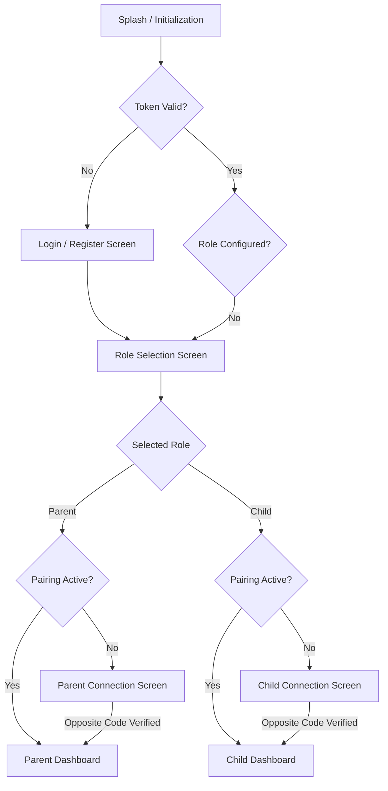
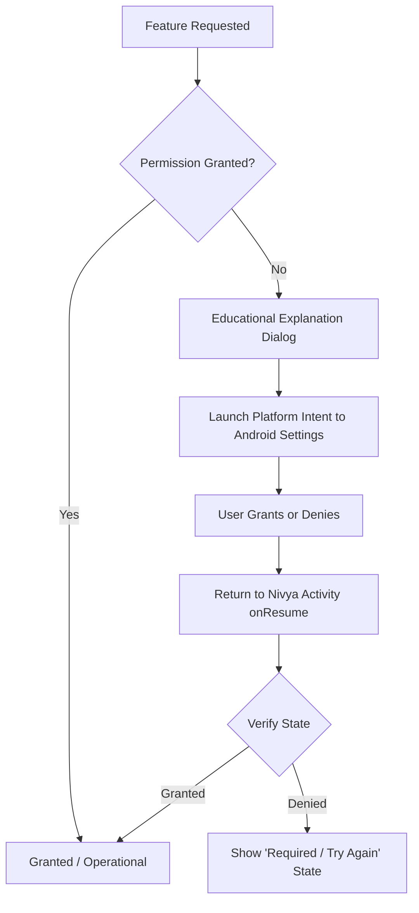

# Nivya — UI Navigation, Role Separation & Experience Guide

## 1. Application Launch & Role Routing



---

## 2. Parent-Child Connection UI

Each phone presents a dedicated pairing card:

### Parent Connection View
```
+------------------------------------------+
|                 Nivya                    |
|             Family Pairing               |
+------------------------------------------+
| Your Connection Code:                    |
| [  NV-4821-KP90  ]  (Tap to copy)        |
|                                          |
| Enter Child's Code:                      |
| [ NV-7315-QA26                         ] |
|                                          |
| [        Connect Devices         ]       |
+------------------------------------------+
```

### Child Connection View
```
+------------------------------------------+
|                 Nivya                    |
|             Device Pairing               |
+------------------------------------------+
| Your Connection Code:                    |
| [  NV-7315-QA26  ]  (Tap to copy)        |
|                                          |
| Enter Parent's Code:                     |
| [ NV-4821-KP90                         ] |
|                                          |
| [        Connect Devices         ]       |
+------------------------------------------+
```

Once linked, pairing screens are dismissed automatically. Reconnection upon reboot or network transition occurs seamlessly in the background.

---

## 3. Role-Specific Dashboards & Menus

### 3.1 Parent Experience
The Parent Dashboard is an uncluttered, high-level device summary:

```
+------------------------------------------+
| Nivya                         [Menu =]   |
| Aarav's Phone                   ONLINE   |
+------------------------------------------+
|  [Battery: 78%]      [Network: 5G Strong]|
|  [Screen Time: 2h 18m] [Health: Good]    |
|  [Location: Home]     [Alerts: 1 New]    |
|                                          |
|  Last Synced: 22:16                      |
+------------------------------------------+
```

**Parent Side Menu Items:**
1. Dashboard
2. Live Activity *(Status-level app/call activity)*
3. History *(Chronological timeline & durations)*
4. App Usage *(Categorized screen time)*
5. Calls / Communication Status
6. Location *(Map view & 30-day history)*
7. Device Health *(Storage & hardware telemetry)*
8. Alerts *(System & device notifications)*
9. Convocation *(Full retained conversation history)*
10. Family / Devices *(Management & unlinking)*
11. Settings

---

### 3.2 Child Experience
The Child Dashboard is focused exclusively on device-care and personal health:

```
+------------------------------------------+
| Nivya                         [Menu =]   |
| My Device Care                           |
+------------------------------------------+
|  [Battery: 62%]      [Network: 4G]       |
|  [Screen Time: 1h 35m][Quality: Excellent|
|  [Location: Near Home][Health: Good]     |
|                                          |
|  [Storage Clean Up Available]            |
+------------------------------------------+
```

**Child Side Menu Items:**
1. Dashboard
2. Battery *(Current charge, health, temperature)*
3. Screen Time *(Daily personal device time)*
4. Network *(Connection type & Network Quality badge)*
5. Location *(Simple status: "Near Home", "Available")*
6. Device Health *(Storage breakdown & app status)*
7. Clean Up *(Interactive cache removal tool)*
8. Alerts *(Device health alerts)*
9. Convocation *(Notepad interface)*
10. Settings

> [!CAUTION]
> **Strict Child Menu Invariant**: The Child navigation hierarchy **must never** render items labeled "Parent Only", "Common", "Parent Access", or disabled parent controls. Parent features are omitted completely.

---

## 4. Android Special Permission Fallback UX

When an advanced system capability is required (such as `PACKAGE_USAGE_STATS` or `NotificationListenerService`), the UI must guide the user smoothly through educational context:



### Fallback State Badges:
- **`Granted`**: Full capability operational.
- **`Required`**: Capability cannot operate until enabled; displays explanatory card with "Enable in Settings" button.
- **`Disabled`**: Previously enabled but subsequently revoked by user in system settings.
- **`Unavailable`**: Android OS version or device manufacturer hardware does not support the capability (e.g. battery temperature sensor missing).
- **`Checking`**: Ephemeral state while verifying permissions upon returning from system settings.

*Nivya never fabricates telemetry when a permission is unavailable.*

---

## 5. Convocation Experience Specification

### 5.1 Parent Convocation View
- Persistent message feed showing all incoming Child messages and sent Parent messages.
- Read receipts (**"Seen"**) appear next to Parent messages once the Child views them.
- Message input field for sending guidance.

### 5.2 Child Convocation View (The Notepad Model)
- **Default Content Area**: Empty text notepad:  
  *`"No messages to show right now. Write something..."`*
- **Options Menu (Top-Right Three Dots)**:  
  Opens a modal/popup with **ONE single On/Off toggle**:
  ```
  +----------------------------------+
  | Options                          |
  +----------------------------------+
  |  [ Turn On ● ] (Single Toggle)   |
  |  Clear Now                       |
  |  How it works?                   |
  +----------------------------------+
  ```
- **Turning Toggle ON**:  
  Accumulated unread Parent messages appear together.
- **2-Minute Auto-Hide Timer**:  
  Messages remain visible for exactly **2 minutes**, after which the toggle flips to OFF and the view reverts to the empty notepad.
- **Child Outgoing Messages**:  
  Child can type a note and press send. The message disappears immediately from Child view, but is persistently stored in Parent history.
- **Generic Notification**:  
  When Parent sends a message, Child device receives:  
  `"Check your battery status"`  
  Tapping it opens Nivya normally without deep-linking into Convocation.
